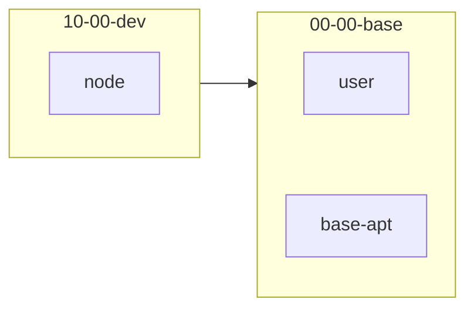

# solen — Development Container Base

This repository provides a configurable, profile-driven development container image and tooling focused on modern devcontainer-based workflows.

Audience:
- Primary: users who want a ready-made, multi-architecture development container image for development, data-science, and tooling.
- Secondary: contributors who extend features, add profiles, or maintain the build/publish pipeline.

---

**Quick Links:**
- **Image registry:** `ghcr.io/ebpro/solen`
- **Generated Dockerfile:** `Dockerfile.generated`
- **Bake definition:** `docker-bake.generated.hcl` (generated by `scripts/generate-bake.sh`)
- **Profiles folder:** `profiles/`
- **Features folder:** `.devcontainer/features/`

---

**What is this repo?**

`solen` is a modular development container project. It builds images from a set of reusable features (small install scripts + metadata) and hierarchical profiles (composed feature sets). The generator scripts produce a multi-stage `Dockerfile.generated` and a `docker-bake.generated.hcl` for multi-platform builds with `docker buildx`.

**Why use it?**
- Ships a curated set of developer tools, language runtimes, and documentation toolchains.
- Supports multi-architecture build (`amd64`, `arm64`) and multi-profile images (minimal, dev, data-science, codeserver, etc.).
- Easily extendable: add new features or compose new profiles.

---

**Quick Start (pull a prebuilt image)**

For common use (consumers):

```bash
# Pull the latest prebuilt image from GitHub Container Registry
docker pull ghcr.io/ebpro/solen:latest

# Run a container interactively (quick debug)
docker run --rm -it ghcr.io/ebpro/solen:latest bash
```

Usage (devcontainers & JetBrains Gateway)

This project is intended primarily as a devcontainer image. For most users there is no need to build images locally — use the prebuilt image from `ghcr.io/ebpro/solen`.

- VS Code / Codespaces / devcontainer:

   - Add a `.devcontainer/devcontainer.json` to your project that references the image, for example:

      ```json
      {
         "name": "solen (devcontainer)",
         "image": "ghcr.io/ebpro/solen:latest",
         "workspaceFolder": "/home/vscode/workspace",
         "extensions": ["ms-python.python"]
      }
      ```

   - Open the folder in VS Code and choose "Reopen in Container".

- JetBrains Gateway:

   JetBrains Gateway supports remote development workflows and can reuse devcontainer configurations (depending on the IDE and plugins). To use `solen` with JetBrains Gateway:

   - Provide the same `.devcontainer/devcontainer.json` in the project root.
   - Start a Gateway session and choose the option to open the project in a container (or use Codespaces if your JetBrains product supports Codespaces integration).

   If you need a dedicated example for a particular JetBrains IDE (IntelliJ, PyCharm), tell me which IDE and I'll add a brief step-by-step example.

Notes:
- The generated diagram for profiles & features is available at `docs/diagrams/features-profiles.mmd` (Mermaid). GitHub renders `.mmd` files natively in the repository view.
- If you want a pre-rendered SVG, you can run the included generator and use `mmdc` to render locally (instructions below in Contributors section).

---

**Profiles & Features (concepts)**

- **Feature**: a small, focused unit (folder under `.devcontainer/features/<name>`) containing `feature.json` (metadata) and an `install.sh` (idempotent install actions). Features should be reusable and side-effect controlled.
- **Profile**: a named collection of features (under `profiles/PROFILE-NAME`) that defines a staged image configuration (for example `00-00-base`, `10-00-dev`, `20-00-data-science`). Profiles can inherit from other profiles via the numeric hierarchical naming.
- **Generator**: scripts under `scripts/` read profiles and features and generate a single, multi-stage `Dockerfile.generated` and a `docker-bake.generated.hcl` for build orchestration.

Where to look:
- Feature code: `.devcontainer/features/`
- Profiles: `profiles/`
- Helper library baked into images: copied to `/opt/solen/_lib` (helper functions used by features at build time).

---

**Diagrams & Documentation (recommended)**

I recommend adding an auto-generated diagram to the docs showing the relationship between features and profiles. Two good choices:

- **Mermaid dependency graph (recommended)**: simple to generate and renderable by GitHub. A graph showing profiles as nodes, edges for inheritance, and grouped feature lists per profile provides a quick overview.
- **Feature × Profile matrix (tabular heatmap)**: a table with profiles as columns and features as rows showing inclusion (✓), helpful for discoverability.

What to display in the diagram:
- Profiles and their numeric hierarchy (parent → child links).
- For each profile, the included features (grouped inside the profile node or listed in a side table).
- Shared features (used by multiple profiles) highlighted.
- Optional: feature categories (e.g., runtime, tooling, editor, docs) as color groups.

Script idea (Mermaid generator):

1. Scan `profiles/` to list profiles and their declared `@parent` or inferred ancestry.
2. Scan `.devcontainer/features/` to find feature IDs (from `feature.json` or folder names).
3. Emit a `docs/diagrams/features-profiles.mmd` Mermaid file with a graph like:



On GitHub the `.mmd` can be rendered using native Mermaid support or pre-rendered to SVG during CI.

Minimal generator (python) outline:

```bash
python scripts/generate_mermaid.py --out docs/diagrams/features-profiles.mmd
```

The script would be small (scan directories + parse `feature.json` files) and is easy to maintain. If you prefer an image artifact, CI can convert the Mermaid to an `svg` using `mmdc` (Mermaid CLI) or `docker run --rm minlag/mermaid-cli`.

---

**Contributor Guide (how to extend & test)**

- Add a new feature: create `.devcontainer/features/<your-feature>/feature.json` and `install.sh`. Keep installs idempotent and self-contained.
- Add a profile: create `profiles/<numeric>-<name>/` and include feature references. Use numeric prefixes to control ordering/hierarchy.
- Regenerate build artifacts:
   ```bash
   ./scripts/generate-dockerfile.sh --all-profiles --out Dockerfile.generated
   ./scripts/generate-bake.sh
   ```
- Validate and test a profile locally (single stage):
   ```bash
   docker buildx build -f Dockerfile.generated --target final-<profile> --load -t ghcr.io/ebpro/solen:test .
   ```
- Run CI locally or via a branch push: the repo contains `.github/workflows/publish-ghcr.yml` which builds and pushes images to `ghcr.io/ebpro/solen` when enabled.

Best practices for contributors:
- Keep `install.sh` scripts small and idempotent.
- Prefer packaging via system package managers (apt, mamba) rather than long custom installs when possible.
- Add tests or smoke checks for features that require network access or long builds.

---

**CI / Publishing notes**

- Images publish to `ghcr.io/ebpro/solen` from CI. The GitHub Actions workflow uses `GITHUB_TOKEN` with `packages: write` permission.
- If you maintain mirrors on Docker Hub, you can add dual-publish tags in the CI workflow to push to `docker.io/<user>/solen` as well.

---

**Appendix: Useful commands**

- Regenerate artifacts:
   ```bash
   ./scripts/generate-dockerfile.sh --all-profiles --out Dockerfile.generated
   ./scripts/generate-bake.sh
   ```
- Print bake targets:
   ```bash
   docker buildx bake --file docker-bake.generated.hcl --print
   ```
- Build a profile locally:
   ```bash
   docker buildx build -f Dockerfile.generated --target final-00-00-base --load -t ghcr.io/ebpro/solen:test .
   ```

---

If you want, I can also:
- Implement the small `scripts/generate_mermaid.py` generator and add a CI step to render `docs/diagrams/features-profiles.svg` on each push, or
- Add a profile × feature matrix generator (CSV/Markdown) for quick discovery.

Which would you prefer as the next step?

