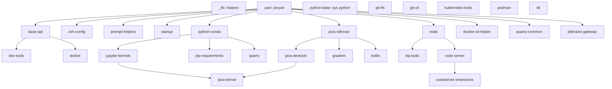

# Feature Dependency Analysis

**Date:** December 18, 2025
**Purpose:** Document implicit dependencies to inform explicit `dependsOn` declarations

---

## Dependency Categories

### Foundation Layer (No Dependencies)
- `_lib` - Shared helper functions
- `user` - Creates NB_USER (jovyan), home directory, sudo access
- `python-base` - System Python3 and pip3

### System Layer (Depends on: user)
- `base-apt` - Core utilities (jq, fzf, tmux, nvim, cmake)
- `zsh-config` - Zsh shell and prezto framework
- `prompt-helpers` - gitstatusd for shell prompts
- `startup` - Startup script runner

### Python Stack
- `python-conda`
  - Depends on: user (for /home/jovyan)
  - Provides: CONDA_DIR, conda, python, jupyter

- `jupyter-kernels`
  - Depends on: python-conda (requires jupyter)
  - Installs: python3, bash, zsh kernels

- `pip-requirements`
  - Depends on: python-conda (requires pip in conda env)
  - Installs packages from artefacts/requirements.txt

### Java Stack
- `java-sdkman`
  - Depends on: user (for /home/jovyan)
  - Provides: SDKMAN, sdk command

- `java-devtools`
  - Depends on: java-sdkman
  - Provides: JDK, Maven, Gradle via SDKMAN

- `java-kernel`
  - Depends on: java-devtools, jupyter-kernels
  - Registers Java kernel with Jupyter

- `graalvm`
  - Depends on: java-sdkman
  - Alternative to java-devtools (conflicts?)

- `kotlin`
  - Depends on: java-sdkman (uses SDKMAN for kotlin)
  - Optional: kotlin-jupyter kernel (needs jupyter-kernels)

### Node Stack
- `node`
  - Depends on: user
  - Provides: node, npm via Volta

- `lsp-tools`
  - Depends on: node (uses npm for pyright)
  - Provides: pyright, optionally others

### Development Tools
- `dev-tools`
  - Depends on: base-apt (builds on core utilities)
  - Adds: gcc, g++, make, build-essential, htop, fd, ripgrep

- `docker-cli-helper`
  - Depends on: user
  - Adds jovyan to docker group

- `git-lfs`
  - No dependencies (standalone binary)

- `gh-cli`
  - No dependencies (standalone binary)

### Content/Document Tools
- `quarto`
  - Depends on: python-conda (for Jupyter integration)
  - Optional: texlive (for PDF output)
  - Sets QUARTO_PYTHON environment variable

- `quarto-common`
  - Depends on: user
  - Creates template directories in /home/jovyan/local

- `texlive`
  - Depends on: base-apt (needs fontconfig libs)
  - Provides: pdflatex, tlmgr

### Container/Kubernetes Tools
- `kubernetes-tools`
  - No dependencies
  - Provides: kubectl, helm, k9s

- `podman`
  - Depends on: user
  - Alternative to docker

- `tilt`
  - No dependencies
  - Kubernetes dev tool

### IDE/Editor
- `code-server`
  - Depends on: user, node
  - VS Code in browser

- `codeserver-extensions`
  - Depends on: code-server
  - Installs VS Code extensions

- `jetbrains-gateway`
  - Depends on: user
  - SSH server for JetBrains remote

---

## Dependency Graph (Mermaid)



---

## Conflict Analysis

### Known Conflicts
- `java-devtools` vs `graalvm` - Both install JDK via SDKMAN
  - Action: Document as mutually exclusive, profiles should choose one

### Potential Conflicts
- `docker-cli-helper` vs `podman` - Both provide container CLIs
  - Action: Verify they can coexist (they can, different tools)

---

## Recommended `dependsOn` Additions

### High Priority (Core Dependencies)
```json
// python-conda/feature.json
{"dependsOn": ["user"]}

// jupyter-kernels/feature.json
{"dependsOn": ["python-conda"]}

// java-devtools/feature.json
{"dependsOn": ["java-sdkman"]}

// java-kernel/feature.json
{"dependsOn": ["java-devtools", "jupyter-kernels"]}

// quarto/feature.json
{"dependsOn": ["python-conda"]}
```

### Medium Priority (Tool Dependencies)
```json
// lsp-tools/feature.json
{"dependsOn": ["node"]}

// code-server/feature.json
{"dependsOn": ["user", "node"]}

// codeserver-extensions/feature.json
{"dependsOn": ["code-server"]}

// kotlin/feature.json
{"dependsOn": ["java-sdkman"]}

// graalvm/feature.json
{"dependsOn": ["java-sdkman"]}
```

### Low Priority (Soft Dependencies)
```json
// pip-requirements/feature.json
{"dependsOn": ["python-conda"]}

// dev-tools/feature.json
{"dependsOn": ["base-apt"]}

// texlive/feature.json
{"dependsOn": ["base-apt"]}
```

---

## Implementation Notes

### Topological Sort Algorithm
Use Kahn's algorithm for dependency resolution:
1. Build in-degree map (count dependencies per feature)
2. Start with features having in-degree = 0
3. Process features in waves, removing resolved dependencies
4. Detect cycles if any features remain with in-degree > 0

### Validation Rules
1. **No cycles**: `A → B → A` is invalid
2. **No missing deps**: All features in `dependsOn` must exist
3. **No self-deps**: Feature cannot depend on itself
4. **Transitive closure**: If A→B and B→C, then A implicitly needs C

### Backward Compatibility
- Features without `dependsOn` are treated as "no dependencies"
- Existing profiles work as-is (ordering preserved if valid)
- Validation is additive (catches errors but doesn't break builds)

---

## Next Steps

1. ✅ Create this dependency analysis
2. ⏳ Add `dependsOn` to all feature.json files
3. ⏳ Create `scripts/validate-feature-deps.sh`
4. ⏳ Update `generate-dockerfile.sh` to auto-order features
5. ⏳ Test on all profiles
6. ⏳ Update feature README with dependency guidelines
